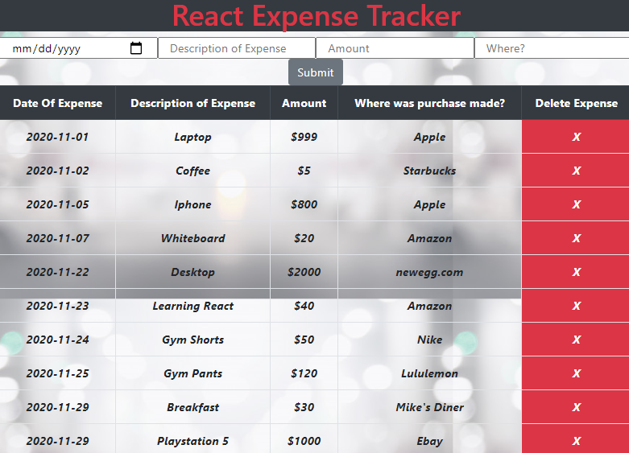

# Expense Tracker created with React.js

Click [here](https://jbri91.github.io/snakeGame/) to try and get a high score!

# Summary

This is my first of many projects using React. This was a huge challenge because it was hard to grasp the idea of passing properties and using state and setState. I still have a lot to learn but I am loving the challenege. Another challenge that I had to overcome was using localStorage and dealing with state at the same time.

I enjoyed the components aspect of React because it helped me break down the app and the logic to focus on certain tasks. This came easier to me because one thing that I have learned that has helped me a ton was breaking the project down into simpler parts. Coming into this project with that mindset already helped me seperate the app into components. With that said, I had to adjust the methods and where I had them in order to pass props from the higher level components. Looking forward to my next project!

# Author
* Johnny Redry Briones Jr. - *Programmer*
[linkedIn].(https://www.linkedin.com/in/johnny-briones-b6068383/)